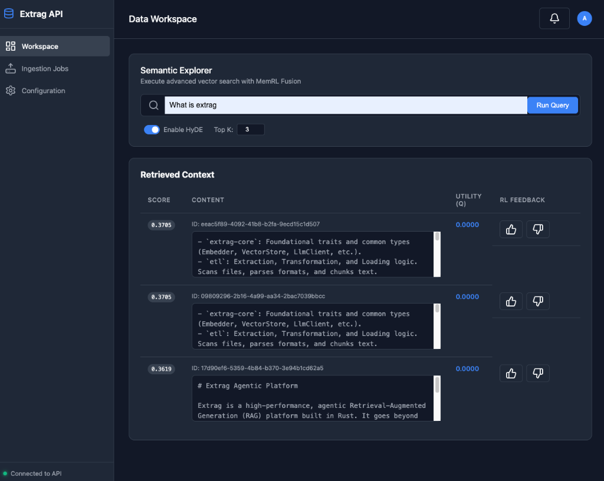

# Extrag Agentic Platform

Extrag is a high-performance, agentic Retrieval-Augmented Generation (RAG) platform built in Rust. It goes beyond traditional RAG by incorporating **MemRL** patterns (Value-Aware Retrieval) and **Reinforcement Learning** feedback loops, allowing the system's memory to evolve based on its real-world performance.



## 🚀 Key Features

- **Agentic Memory (MemRL)**: Every document chunk carries a Utility Profile ($Q$-score). Retrieval is a fusion of Semantic Similarity and Historical Utility.
- **Delta Vectorization**: Content-aware ingestion pipeline that hashes files to skip unchanged documents, drastically reducing embedding API costs.
- **Advanced Retrieval Stage**:
  - **HyDE (Hypothetical Document Embeddings)**: Context expansion by generating "ideal" answers before searching.
  - **Z-Score Fusion**: Balanced retrieval using normalized semantic and value scores.
- **Multi-Backend Support**: Concrete, stable implementations for **Qdrant** (Vector Store) and **Ollama** (LLM & Embeddings).
- **Concurrent Ingestion**: High-throughput streaming pipeline built with `tokio-stream` and buffered async processing.
- **REST First API**: A professional Axum-based API providing clean endpoints for agents to ingest, retrieve, and provide feedback.

## 🏗 Project Structure

- `extrag-core`: Foundational traits and common types (Embedder, VectorStore, LlmClient, etc.).
- `etl`: Extraction, Transformation, and Loading logic. Scans files, parses formats, and chunks text.
- `rag`: The orchestration layer for Ingestion Pipelines and Retrieval Engines.
- `api`: The Axum REST server providing the platform interface.

## 🛠 Getting Started

### Prerequisites

1.  **Ollama**: Install [Ollama](https://ollama.ai/) and pull the required models:
    ```bash
    ollama pull gemma4:latest
    ```
2.  **Docker**: Required to run Qdrant.

### Running the Platform

1.  **Start the Infrastructure**:
    ```bash
    docker-compose up -d
    ```
2.  **Start the API Server**:
    ```bash
    cargo run -p api
    ```

## 📡 API Endpoints

| Method | Endpoint | Description |
| :--- | :--- | :--- |
| `POST` | `/v1/ingest` | Delta-aware ingestion of a directory. |
| `POST` | `/v1/retrieve` | Advanced Retrieval (HyDE + MemRL Fusion). |
| `POST` | `/v1/feedback` | RL reward loop for updating chunk utility. |

## 🧪 Testing

Run the full workspace test suite:
```bash
cargo test --workspace
```

## 📜 License

MIT
